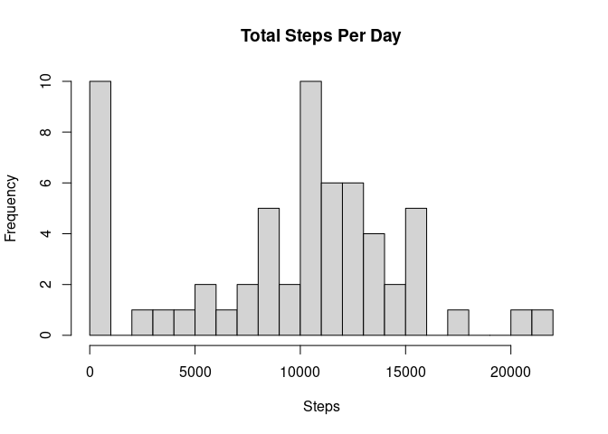
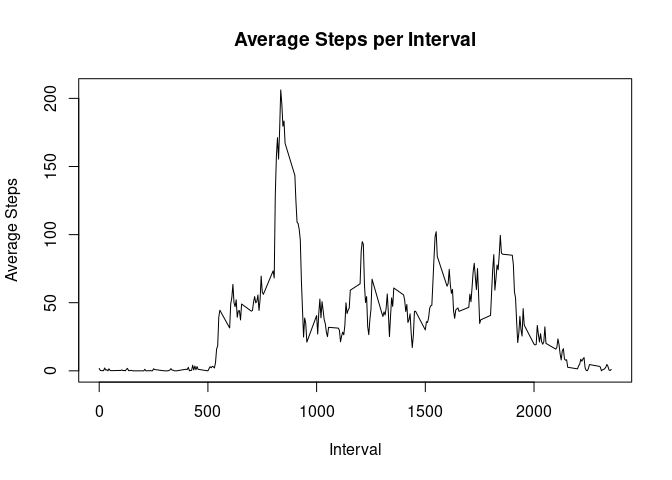
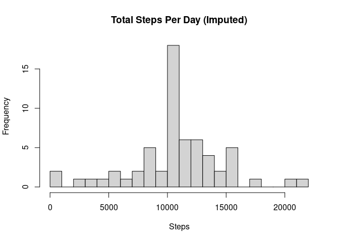
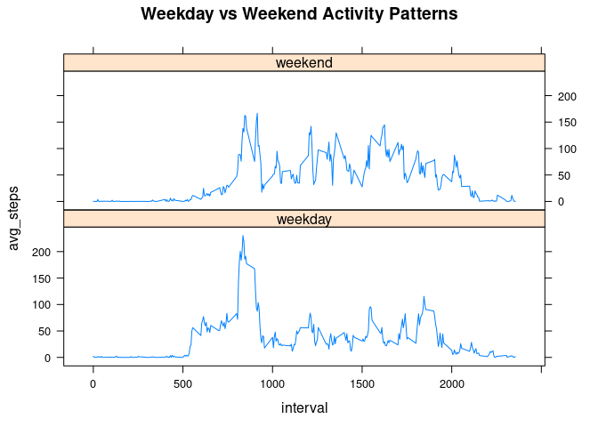

---
title: "PA1 Analysis"
author: "Your Name"
date: "2025-03-23"
output: 
  html_document:
    keep_md: true
---


## 1. Loading and preprocessing the data


```r
activity <- read.csv("activity.csv")
activity$date <- as.Date(activity$date)
```

## 2. What is mean total number of steps taken per day?


```r
total_steps <- activity %>%
  group_by(date) %>%
  summarise(total = sum(steps, na.rm = TRUE))
```

```
## `summarise()` ungrouping output (override with `.groups` argument)
```

```r
hist(total_steps$total, main = "Total Steps Per Day", xlab = "Steps", breaks = 20)
```

<!-- -->

```r
mean_steps <- mean(total_steps$total, na.rm = TRUE)
median_steps <- median(total_steps$total, na.rm = TRUE)

mean_steps
```

```
## [1] 9354.23
```

```r
median_steps
```

```
## [1] 10395
```

## 3. What is the average daily activity pattern?


```r
avg_interval <- activity %>%
  group_by(interval) %>%
  summarise(avg_steps = mean(steps, na.rm = TRUE))
```

```
## `summarise()` ungrouping output (override with `.groups` argument)
```

```r
plot(avg_interval$interval, avg_interval$avg_steps, type = "l",
     main = "Average Steps per Interval", xlab = "Interval", ylab = "Average Steps")
```

<!-- -->

```r
avg_interval[which.max(avg_interval$avg_steps), ]
```

```
## # A tibble: 1 x 2
##   interval avg_steps
##      <int>     <dbl>
## 1      835      206.
```

## 4. Imputing missing values


```r
# Count NAs
sum(is.na(activity$steps))
```

```
## [1] 2304
```

```r
# Use mean for that interval to replace NAs
activity_filled <- activity
activity_filled$steps[is.na(activity_filled$steps)] <- avg_interval$avg_steps[
  match(activity_filled$interval[is.na(activity_filled$steps)], avg_interval$interval)
]

# Histogram after imputation
filled_total <- activity_filled %>%
  group_by(date) %>%
  summarise(total = sum(steps))
```

```
## `summarise()` ungrouping output (override with `.groups` argument)
```

```r
hist(filled_total$total, main = "Total Steps Per Day (Imputed)", xlab = "Steps", breaks = 20)
```

<!-- -->

```r
mean(filled_total$total)
```

```
## [1] 10766.19
```

```r
median(filled_total$total)
```

```
## [1] 10766.19
```

## 5. Are there differences in activity patterns between weekdays and weekends?


```r
activity_filled$day_type <- ifelse(weekdays(activity_filled$date) %in% c("Saturday", "Sunday"),
                                   "weekend", "weekday")
activity_filled$day_type <- as.factor(activity_filled$day_type)

day_avg <- activity_filled %>%
  group_by(interval, day_type) %>%
  summarise(avg_steps = mean(steps))
```

```
## `summarise()` regrouping output by 'interval' (override with `.groups` argument)
```

```r
library(lattice)
xyplot(avg_steps ~ interval | day_type, data = day_avg, type = "l",
       layout = c(1,2), main = "Weekday vs Weekend Activity Patterns")
```

<!-- -->
